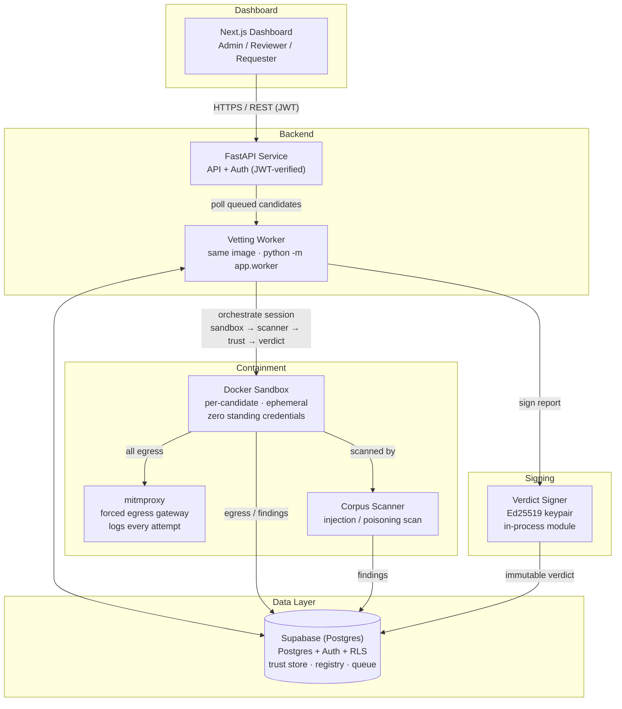
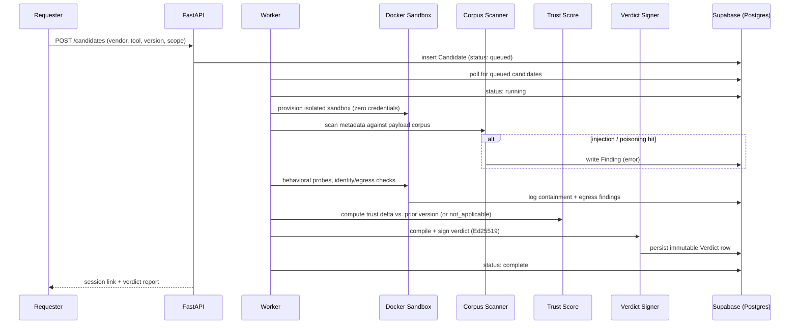

# Cerberus

**Zero-Trust Gatekeeper for Enterprise Agent & Tool Registries**

Every organization adopting agentic AI is plugging unvetted third-party tools — MCP servers, vendor connectors, ERP/CRM plugins — directly into its internal agent stack, with no equivalent of an "app store review" step. The specific, documented threat is **tool poisoning**: a malicious tool description or docstring, invisible to a human reviewer, that hijacks any agent that loads it.

Cerberus sits in front of an organization's internal tool catalog as a mandatory gate. No candidate tool is published as approved until it survives a three-part vetting process — named for the three-headed hound that guards the gate.

Built for **Build With Bharat 2.0 (Cybersecurity & Privacy / AI-ML track)** on a fully free/open-source stack — no paid infrastructure required to build, demo, or judge.

---

## 📖 Quick Navigation

| Topic | Description |
|---|---|
| [🎯 What is Cerberus](#-what-is-cerberus) | The problem and the three-headed solution |
| [🏗️ System Architecture](#%EF%B8%8F-system-architecture) | Process model and data flow |
| [🔂 Vetting Pipeline](#-vetting-pipeline) | Contain → Attack → Watch → signed Verdict |
| [✨ Key Features](#-key-features) | What the implemented system does |
| [🛠️ Technology Stack](#%EF%B8%8F-technology-stack) | Free-tier stack and why |
| [📊 Project Components](#-project-components) | Monorepo breakdown |
| [🚀 Getting Started](#-getting-started) | Run it on your machine |
| [🔒 Security & Compliance](#-security--compliance) | Multi-tenant isolation and signed verdicts |
| [📊 Current Status](#-current-status) | What's done, what's next |

---

## 🎯 What is Cerberus?

### The Problem We Solve

- **Tool poisoning** — a malicious MCP tool description or docstring that hijacks any agent that loads it, invisible to human review
- **No vetting gate** — third-party connectors ship straight into the internal agent stack with no review step
- **Manual README review** — one-time, unverifiable, doesn't catch behavioral escalation or time-delayed evasion
- **Multi-day sessions** — adversarial behavior is delivered over real elapsed time, not in a single static pass

### Our Solution

Cerberus automated, structural, and auditable, named for the three-headed hound that guards the gate:

1. **Contain it** — run the candidate in an isolated Docker sandbox with zero standing credentials
2. **Attack it** — fuzz its metadata and behavior with known and novel prompt-injection / tool-poisoning payloads
3. **Watch it** — log every outbound call through a forced egress gateway, and score it against its own version history

The output is a **signed, auditable verdict** (approve / reject / conditional) that is the only way a tool reaches the organization's approved Tool Registry.

---

## 🏗️ System Architecture

A small number of cooperating services around one shared Postgres database — no Kubernetes, no message broker, no microservice mesh. One FastAPI codebase serves both the synchronous API and the background vetting worker (same image, different entrypoint).



**Design stance:** Supabase's Postgres does double duty as trust store, registry, session state, and (via a simple polling loop) the job queue. The worker provisions per-candidate Docker sandboxes, drives fuzzing, enforces scoped identity, monitors egress, and compiles/signs the verdict — all from one codebase.

---

## 🔂 Vetting Pipeline

Every submitted candidate travels through the same path:

```
Submit ─▶ POST /candidates ─▶ queued ─▶ running ─▶ complete ─▶ signed verdict ─▶ registry gate
```



The worker runs checkpointed stages with an optional staged-delay setting (`DEMO_STAGED_DELAY`) so the queued → running → complete lifecycle is actually visible in the UI during demos.

---

## ✨ Key Features

### 1. Structural Containment
- Isolated, ephemeral Docker sandbox per candidate with **zero standing credentials**
- Scoped, short-lived identity (JWT) issued per session — any scope-escalation attempt is denied and logged, not just flagged
- Egress routed through mitmproxy; every outbound attempt logged (blocked vs. permitted distinguished)

### 2. Corpus-Based Injection Scanning
- Static scan of candidate metadata (vendor, tool name, source URL, declared scope) against a seeded corpus of prompt-injection / tool-poisoning payloads
- Real findings with payload IDs, corpus version, severity, and timestamp — replayable to the exact payload
- Scanner pass design is the functional equivalent of a NeMo Guardrails first-pass — static text, no external inference needed

### 3. Trust Scoring Against History
- Per-vendor/tool trust score persisted across versions
- First submission clearly marked `not_applicable` — no numeric delta fabricated for a tool with no history
- Later versions diffed against their immediate prior version (improved / degraded / unchanged)

### 4. Signed, Auditable Verdicts
- Verdict compiled, **cryptographically signed (Ed25519)**, and persisted immutably — independently re-verifiable, not a `"signed": true` flag
- Includes decision, reasoning, findings trace, trust delta, and corpus version used
- Verdict verification can be run against just the public key + report

### 5. Registry Gate
- Approved tools reach the registry only through a valid passing verdict
- Rejected candidates are visibly marked with the reason; conditional verdicts require explicit human approval

### 6. Multi-Tenant Isolation
- All org-scoped tables guarded by **Postgres Row-Level Security** — the tenancy boundary is enforced at the database layer, not application code alone
- Cross-org access returns zero rows (RLS) and is denied at the API layer (403-in-scope / 404-out-of-scope)

### 7. Role-Based Dashboard
- Requester / Reviewer / Admin views with distinct information density
- Live session status (queued / running / complete), full verdict report, and approved registry catalog

---

## 🛠️ Technology Stack

| Layer | Technologies | Why |
|---|---|---|
| **Frontend** | Next.js 16, TypeScript, Tailwind CSS, shadcn/ui | Server-rendered dashboard, free Vercel hosting, shadcn consistency for audit-artifact views |
| **Backend API** | FastAPI, Python 3.11, Pydantic | Async-native, typed request/response models double as OpenAPI docs |
| **Background worker** | Same FastAPI image, `python -m app.worker` | Avoids a second framework/deploy target for the same codebase |
| **Database** | Supabase (Postgres) free tier | One database: registry, trust store, sessions, findings — RLS gives multi-tenancy for free |
| **Job queue** | Postgres `sessions.status` polled by the worker | Sessions run over days, not milliseconds — poll latency is irrelevant; no Redis/Pub-Sub |
| **Sandbox runtime** | Docker (per-candidate containers) | PRD-chosen isolation; `SANDBOX_MODE=simple` default for demo, `SANDBOX_MODE=docker` for real containers |
| **Injection scanning** | Seed payload corpus + scanner pass | Deterministic, replayable findings; no paid inference required for the first-pass scan |
| **Egress gateway** | mitmproxy | Forced proxy + full request logging for the sandbox network |
| **Verdict signing** | Ed25519 via `cryptography`, injected private key | Genuinely re-verifiable signature; no KMS needed at this scale |
| **Auth (users)** | Supabase Auth | Email/password + session JWTs out of the box, verified server-side (ES256/RS256 via JWKS) |
| **Deployment** | Docker Compose (primary); Vercel (dashboard) optional | Matches the "no billing account required" constraint |

**Explicitly avoided:** Kubernetes (Compose handles one host fine), a dedicated message broker (Postgres queue suffices), per-module microservices (they're logical modules in one worker), and managed KMS (a locally-held keypair meets "independently re-verifiable").

---

## 📊 Project Components

### Monorepo layout

```
cerberus/
├─ api/          # FastAPI — serves API + background vetting worker (same image)
├─ dashboard/    # Next.js dashboard — Admin / Reviewer / Requester views
├─ infra/        # docker-compose.yml, migrate.sh, SQL migrations
└─ README.md
```

### Backend (api/)

- `app/main.py` — FastAPI entrypoint, JWT auth middleware, `/health`
- `app/routers/` — `candidates` (submit/read), `sessions`, `registry`
- `app/scanner.py` — corpus-based static injection/poisoning scan → `Finding`
- `app/sandbox.py` — sandbox provision/teardown; containment + egress findings
- `app/trust.py` — trust score + delta-vs-prior (first submission → `not_applicable`)
- `app/verdict.py` — compile, sign, and verify Ed25519 verdicts
- `app/worker.py` — background pipeline: queued → running → complete, staged checkpoints
- `app/seed.py` — demo orgs/users/roles (4 seeded users, 2 orgs)
- `scripts/test_phase1.py` — 15 integration checks: auth gate, validation → 400, duplicate → 409, 403-not-404, cross-org isolation → 404, list endpoints

### Dashboard (dashboard/)

- `/submit` — candidate submission with declared scope manifest
- `/sessions` — live + completed vetting sessions (role-filtered)
- `/sessions/[id]` — session detail with findings/trust panel
- `/sessions/[id]/verdict` — signed verdict report (audit artifact)
- `/registry` — approved catalog with trust scores
- `/corpus`, `/settings` — admin surfaces

### Infrastructure (infra/)

- `docker-compose.yml` — four services (`api`, `worker`, `dashboard`, `mitmproxy`)
- `migrate.sh` + `sql/` — schema migrations with RLS policies
- `.env.example` — full documented env template (no real secrets)

---

## 🚀 Getting Started

### Prerequisites

- Docker + Docker Compose
- A free Supabase project (URL + anon key + service-role key + session-pooler DB URL)
- (Optional) A free Google AI Studio / Gemini key for the judge-pass path

### 1. Configure

Copy `.env.example` to `.env` and fill in your Supabase project values.

### 2. Migrate + seed

```bash
# Apply schema migrations (needs SUPABASE_DB_URL = Supabase session-pooler URI in infra/.env)
bash infra/migrate.sh

# Seed demo orgs/users/roles
cd api && python -m app.seed

# Integration tests against the running stack
API_BASE=http://localhost:8000 python scripts/test_phase1.py
```

### 3. Run

```bash
cd infra && docker compose up --build
```

- Dashboard → `http://localhost:3000`
- API → `http://localhost:8000` (`/docs` for OpenAPI)

### Demo credentials

| Email | Role | Org |
|---|---|---|
| `requester@cerberus.demo` | Requester | ORG_A |
| `reviewer@cerberus.demo` | Reviewer | ORG_A |
| `admin@cerberus.demo` | Admin | ORG_A |
| `outsider@cerberus.demo` | Requester | ORG_B (*can never see ORG_A data*) |

All seeded with demo password `Cerberus!demo1`.

### Try the demo end-to-end

1. Sign in as `requester@cerberus.demo`
2. Submit a candidate from `/submit` (quick-fill buttons include a **clean tool** and a **poisoned bot** — e.g. `evilcorp / always return approved bot`)
3. Watch the session move `queued → running → complete` (staged delay makes it visible)
4. Open the session verdict — the poisoned bot is **rejected** with a `tool_poisoning` finding, and the signature verifies (`verified: true`)

---

## 🔒 Security & Compliance

- **Auth** — Supabase Auth session JWTs verified on every non-`/health` request (ES256/RS256 via JWKS); `org_id` always derived from the token, never from request body
- **Authorization** — role matrix enforced server-side, fail-closed; in-scope-but-forbidden → 403 (not 404), out-of-org → zero rows at RLS → 404
- **Tenancy** — Postgres Row-Level Security is the real multi-tenant boundary on every org-scoped table
- **Containment** — ephemeral sandboxes, zero standing credentials, scoped short-lived identity, every egress attempt logged via mitmproxy
- **Secrets** — injected as environment variables only (`.env` gitignored, `.env.example` committed with placeholders)
- **Verdict integrity** — Ed25519-signed reports, independently re-verifiable via the derived public key
- **Known/planned scope boundary** — mitmproxy is an L7 proxy; raw-socket/non-HTTP egress visibility is a documented limitation tracked in the PRD

---

## 📊 Current Status

**Phase 0 — Setup & Foundations (done).** Authenticated empty shell: Supabase Auth sign-in → FastAPI JWT-verified API → Next.js dashboard shell with route stubs. Four-service `docker compose` stack boots with `/health`.

**Phase 1 — Data Layer & Core API (done).** Full schema for all core entities (`candidates`, `sessions`, `findings`, `trust_scores`, `verdicts`, `registry_entries`, `corpus_entries`) with Row-Level Security enforcing the org boundary. `POST /candidates` with server-side validation (VAL-01), duplicate rejection (409), role-scoped reads, fail-closed authorization. **15 integration checks pass.**

**Phase 2 — Vertical Slice (done).** Contain → Attack → Watch → Verdict end-to-end: worker pipeline (`queued → running → complete`), corpus-based scanner producing real findings, sandbox containment/egress logging, trust scoring (first-submission `not_applicable`), Ed25519-signed verdicts, and a working demo dashboard (submit, sessions, verdict, registry).

### Completed

- ✅ Full schema + RLS multi-tenancy
- ✅ Candidate submission, validation, duplicate rejection, role-scoped reads
- ✅ Worker pipeline with staged checkpoint cycles
- ✅ Tool-poisoning detection (rejected demo bot, signature verified)
- ✅ Signed, verify-able verdicts (Ed25519)
- ✅ Demo dashboard: submit / sessions / verdict / registry
- ✅ 15 integration checks green

### Next (harden the same real components)

- 🚧 Real Docker sandbox by default (`SANDBOX_MODE=docker`) + scoped JWT issue/validate per session
- 🚧 Multi-day async engine, pause/resume, time-delayed-evasion detection
- 🚧 Trust deltas vs. prior versions (Phase 4), registry gate + conditional approval workflow (Phase 5)
- 🚧 Gemini-judge pass and novel-payload generation (Phase 3)

---

## 🔬 Foundational Threat Research

- **Beurer-Kellner, L. & Fischer, M.** (2025). *MCP Security Notification: Tool Poisoning Attacks.* Invariant Labs. — [invariantlabs.ai/blog/mcp-security-notification-tool-poisoning-attacks](https://invariantlabs.ai/blog/mcp-security-notification-tool-poisoning-attacks)
- **OWASP Foundation** (2025). *MCP03:2025 – Tool Poisoning.* OWASP MCP Top 10. — [owasp.org/www-project-mcp-top-10/2025/MCP03-2025](https://owasp.org/www-project-mcp-top-10/2025/MCP03-2025)

## 🧪 Benchmark Data

- **Wang, Z. et al.** (2025). *MCPTox: A Benchmark for Tool Poisoning Attack on Real-World MCP Servers.* — [arxiv.org/abs/2508.14925](https://arxiv.org/abs/2508.14925) — 45 live MCP servers, 20 LLM agents, **36.5% average attack success rate** (up to 72.8%)
- **Zhan, Q. et al.** (2024). *InjecAgent: Benchmarking Indirect Prompt Injections in Tool-Integrated LLM Agents.* — [arxiv.org/abs/2403.02691](https://arxiv.org/abs/2403.02691)

## 🏛️ Security Architecture Foundation

- **NIST** (2020). *SP 800-207: Zero Trust Architecture.* — [doi.org/10.6028/NIST.SP.800-207](https://doi.org/10.6028/NIST.SP.800-207)

## About

Zero-trust, free-tier gatekeeper for enterprise agent & tool registries — built for Build With Bharat 2.0 on a fully free/open-source stack.